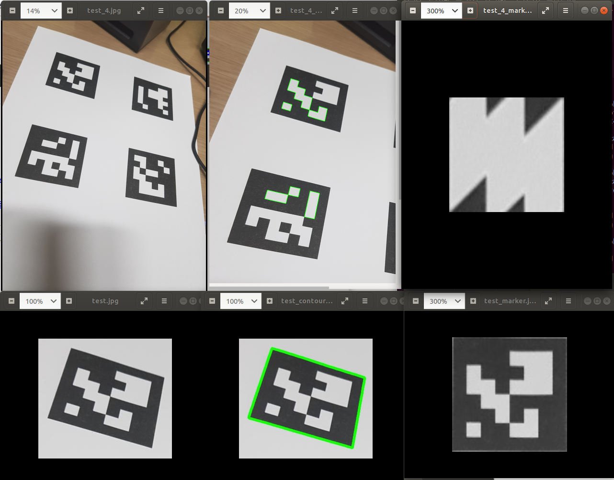

# vision-based-localization
openCV, openGL

OS : Ubuntu 18.04 LTS  
openCV : 4.1.1

  
#### - marker -> calibration -> detection -> opengl -> (???)
  
----

Screenshot
----
- problem  
    

- contour  

- axis

- openGL

- result

