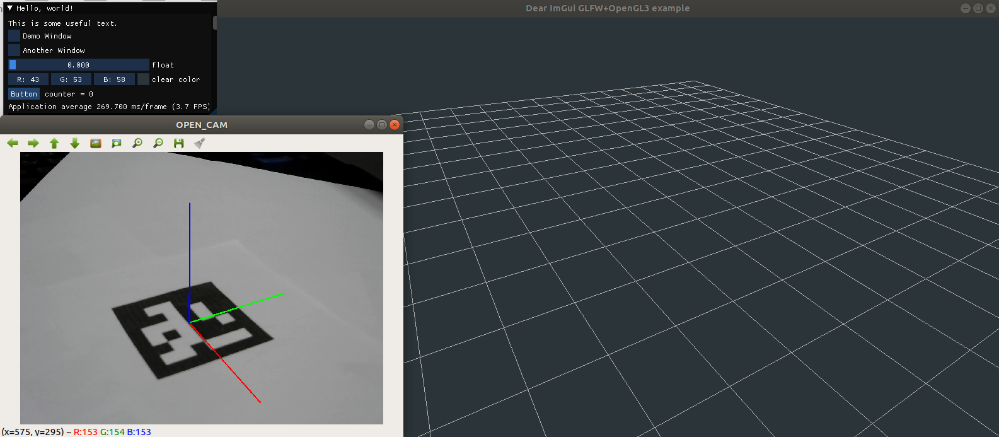

# vision-based-localization
OS : Ubuntu 18.04.3 LTS  
OpenCV version : 4.1.1  
OpenGL version : 4.3  

영상 기반 카메라 위치 추출 및 openGL 연동

----

#### Required Library
- assimp  
  <pre>$ sudo apt-get install libassimp-dev assimp-utils
  $ sudo apt-get install libxmu-dev libxi-dev</pre>

- glfw  
  <pre>$ sudo apt-get install libglfw3-dev libglfw3</pre>  

- glm  
  <pre>$ sudo apt install libglm-dev</pre>

----
  
### 1. ChArUco
1) make a charucoboard to calibrate  
   <code>
   g++ -o charucoboard charucoboard.cpp $(pkg-config opencv4 --cflags --libs)
   </code>  
   create <code>board.jpg</code>
2) calibrate  
   <code>
    $ g++ -o calibrate calibrate.cpp $(pkg-config opencv4 --cflags --libs)   
   </code>  
   press 'c' 5 or more times. 'ESC' to finish and calibrate.
   create <code>output.txt</code>

### 2. Build
1) In "KnuMakerViewer", <code>$ cmake CMakeLists.txt</code>
2) create <code>viewer</code> by <code>$ make</code> 

#### Error  
- GLSL 3.30 is not supported : In <code>./KnuMarkerViewer/shader/grid.vs</code>, change like this.  
  <pre>
  #version 130
  
  // ...
  in vec3 vertexPosition;
  in vec3 vertexColor;
  ...</pre>  
  In <code>./KnuMarkerViewer/shader/grid.fs</code>, change like this.
  <pre>
  #version 130
  ...</pre>

### 3. Run
1) <code> $./viewer </code>  
   default - marker ID : 0, camera ID : 0
2) <code> $./viewer (marker ID) </code>  
   <code> $./viewer (marker ID) (cameara ID) </code>

### 4. Result 
  
  
----
