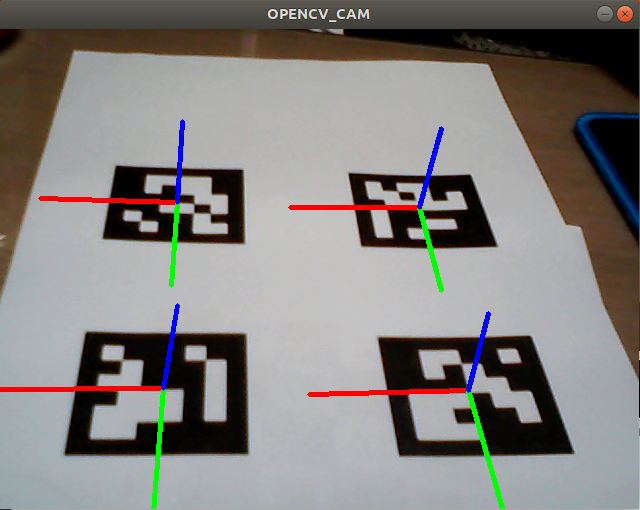

before do this, create markers and ChArUco board for calibration
### ArUco marker detection and drawing 3D axis
<pre>
$ g++ -o markerdetection markerdetection.cpp $(pkg-config opencv4 --cflags --libs)
$ ./markerdetection
</pre>  

- update(code simplification)  
  - markerdetection.cpp : image -> greyscale -> contour -> transformation, nums of white cell -> identify -> drawAxis  
  - marketdetection_2.cpp : image -> detectMarkers -> drawAxis  
    No need "dictionary.hpp"

----
  
Screenshot
----

